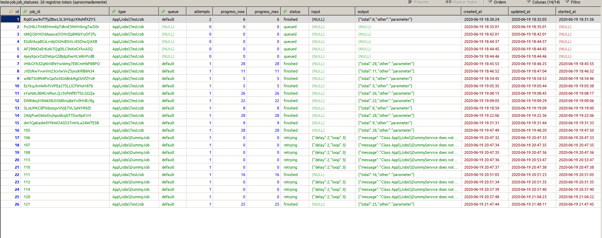

# Laravel 6.2

 

> Exemplos de como usar o novo recurso do laravel 6 chamado Lazy collections class.
> Lazy Collection é uma classe que fornece iteradores para os itens da matriz. Se você souber no Laravel 5, temos uma classe Collection que é usada para agrupar itens da matriz. então basicamente no Laravel 6 temos uma classe Lazy Collection adicional aqui junto com a classe Normal Collection.

## Qual é o uso da classe Lazy Collections?
> A classe Lazy collection é projetada especificamente para manter o uso da memória baixo pelos aplicativos de laravel que utilizam o poder dos Geradores PHP, se você não usar o Generator, é basicamente uma sintaxe da criação do iterador no PHP.
- https://www.php.net/manual/en/language.generators.overview.php
> Vamos imaginar que a tabela do banco de dados de aplicativos tenha milhares de linhas e você deseja buscar todas elas para que um requisito específico esteja exportando para o Excel ou qualquer arquivo.
> Se você tentar usar o all()método Laravel Eloquent , provavelmente o aplicativo lançará uma exceção de falta de memória e isso ocorre porque, quando você executa todas as consultas, ele busca todos os registros e armazena na memória, então é óbvio que se você tentar milhares ou lakhs ou registros, o aplicativo explodirá.

```php
use Illuminate\Support\LazyCollection;
```

## Temper Assessment


### Requirements
- PHP 7.2
- Composer
- NPM
- A beer 🍺

### Installation
Follow the following steps in your console:
- Clone the repo to your local machine
- Run `composer install`
- Run `npm install`
- Run `npm run dev`
- Run `cp .env.example .env`
- Run `php artisan key:generate`
- Run `php artisan serve`

## Install TailWindCSS - Laravel 6 Application with Tailwind CSS Installed
npm install tailwindcss
npx tailwind init

### Testing
You need phpunit installed on your local machine for testing.
- Run `phpunit` in the console to run the tests

### Result
You should see te following result after clicking on the "Click here to view the desired chart"-link:

![Result]screenshot.png)

## Laravel 6 Novidades] - Lazy Collections #laravel #php
- https://www.youtube.com/watch?v=qiupRQdXltc

### Links
- https://www.amitmerchant.com/using-lazy-collections-on-memory-hungry-operations-in-laravel6/
- https://www.itechempires.com/2019/09/practical-useful-examples-of-using-laravel-6-lazy-collection-class/amp/
- https://tailwindcss.com/

> Status jobs
- https://packagist.org/packages/imtigger/laravel-job-status
- https://laravel.com/docs/6.x/horizon
- https://laravel.com/docs/6.x/telescope

 

> @cpdrenato
## Renato lucena - 2020